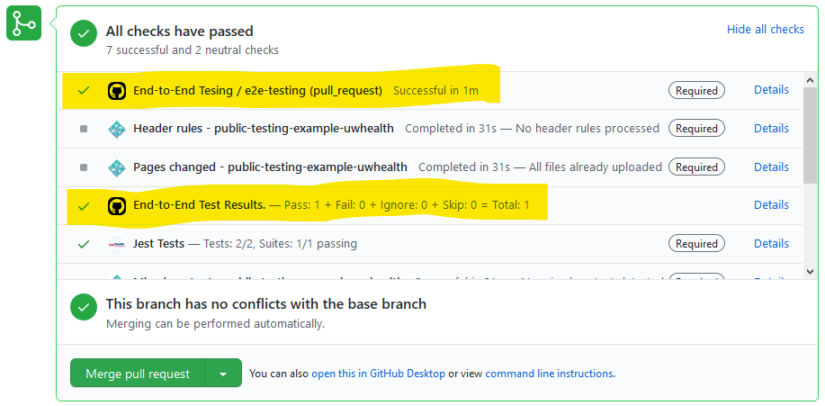

# TestNG Results Handler


This action does the following:

1. Read a standard [testng results report xml file](https://testng.org/doc/documentation-main.html#logging-xml-reports), and extract the results summary

2. Set a successful GitHub Commit Status with the results.

## Inputs

### `testng_results`

**Required**. Path relative to the root for the TestNG results. Default `"testng-results.xml"`.

### `token`

**Required**. The token provided by GitHub actions via secrets.GITHUB_TOKEN. Default _none_.

### `status_url`

_Optional_. URL to display alongside the Github Commit Status. Default _none_.

### `status_label`

_Optional_. URL to display alongside the Github Commit Status. Default _End-Test Results_.

### `skipped_threshold_number`

_Optional_. The number of skipped tests in simple numeric form (example: 20) above which indicates failure. If nothing is supplied ANY skipped test indicates failure. Takes presidenc over skipped_threshold_percent. Default '0'.

### `skipped_threshold_percent`

_Optional_. The percentage of skipped tests in simple numeric form with % symbol (example: 10%) above which indicates failure. If nothing is supplied ANY skipped test indicates failure. Default '0'.

### `failed_threshold_number`

_Optional_. The number of failed tests in simple numeric form (example: 20) above which indicates failure. If nothing is supplied ANY failed test indicates failure. Takes presidence over failed_threshold_percent. Default: '0'.

### `failed_threshold_percent`

_Optional_. The percentage of failed tests in simple numeric form with % symbol (example: 10%) above which indicates failure. If nothing is supplied ANY failed test indicates failure. Default: '0'.

### `skip_gihub_status_update`

_Optional_. Skip the github status update that include the TestNG results. Only string value of "true" will disable. Useful during testing. Default: 'false'.

## Outputs

No outputs.

## Example usage

```yaml
  - uses: UWHealth/testng-results-handler@v1.0.0
    with:
      testng_results: __tests__/testng-results.xml
      token: ${{ secrets.GITHUB_TOKEN }}
      status_url: https://accounts.saucelabs.com/am/XUI/#login/
      failed_threshold_percent: 2
      skipped_threshold_percent: 20
```

Appearance in the Pull Request GUI:



## Development

Install the dependencies

```bash
npm install
```

Build the typescript, lint, format and package it for distribution

```bash
npm run all
# which is short for
npm run build && npm run format && npm run lint && npm run pack && npm test
```

Running the tests separately. Test simply calls the TypeScript transpiled JavaScript with mock information.

```bash
$ npm test
 PASS  __tests__/status.test.ts
  GitHub Status
    √ GitHub Status Set Correctly (91 ms)

  console.log
    GitHub Status Set Correctly Conclusion: true

      at __tests__/status.test.ts:54:13

 PASS  __tests__/main.test.ts
  Build and run Tests
    √ Test the build for successful execution. (204 ms)
    √ Test run console.log for expected message. (27 ms)
    √ Test core debug for expected messages. (12 ms)

  console.log
    Failed: 13

      at __tests__/results.test.ts:41:13

  console.log
    Github status with TestNG results skipped. Input(skip_gihub_status_update): true

      at Object.<anonymous> (__tests__/main.test.ts:27:15)

 PASS  __tests__/results.test.ts
  Results Test
    √ Default inputs (81 ms)
    √ Total Expected 231 (10 ms)
    √ Passed Expected 206 (5 ms)
    √ Failed Expected 13 (4 ms)
    √ Ingnored Expected 3 (3 ms)
    √ Skipped Expected 0 (3 ms)
    √ given 0, 0, *0*, *0* as args, return *true* false true false (5 ms)
    √ given 0, 0, *4*, *0* as args, return *true* false false false (1 ms)
    √ given 0, 0, *6*, *0* as args, return *true* false true false
    √ given 0, 0, *0*, *10* as args, return *true* false false false
    √ given 0, 0, *0*, *14* as args, return *true* true false false (1 ms)
# skipped results
    √ given *1*, *6*, 0, 0 as args, return true true false *false* (1 ms)
    √ given *3*, *4*, 0, 0 as args, return true false true *false*
    √ given *3*, *6*, 0, 0 as args, return true true true *true* (1 ms)

Test Suites: 3 passed, 3 total
Tests:       82 passed, 82 total
Snapshots:   0 total
Time:        2.437 s, estimated 3 s
Ran all test suites.
```
